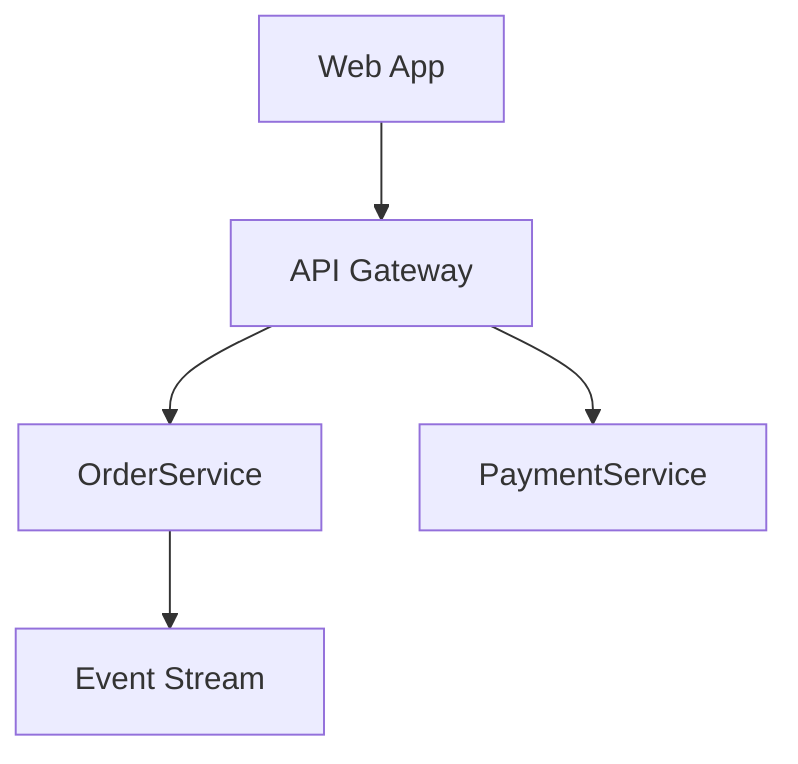

# EventCatalog Resource Types — Complete Reference

## Table of Contents

1. [Domains](#domains)
2. [Services](#services)
3. [Events](#events)
4. [Commands](#commands)
5. [Queries](#queries)
6. [Channels](#channels)
7. [Flows](#flows)
8. [Data Stores (Containers)](#data-stores)
9. [Entities](#entities)
10. [Diagrams](#diagrams)
11. [Users](#users)
12. [Teams](#teams)
13. [Common Frontmatter Fields](#common-fields)
14. [Message Organization Patterns](#message-organization)

---

## 1. Domains <a name="domains"></a>

**Directory**: `domains/{DomainName}/index.mdx`

Domains represent bounded contexts from Domain-Driven Design. They group services, entities, messages, and other domains (subdomains).

### Features

- Subdomains (nested domains)
- Ubiquitous language dictionaries
- Entity maps
- Domain Integration Map (shows cross-domain message flows)
- Service grouping
- Visualizer support

### Complete Frontmatter

```yaml
---
id: Orders
name: Orders
version: 0.0.1
summary: |
  Domain that contains order-related information
owners:
  - dboyne
  - order-team

# Contained resources
services:
  - id: PaymentService
    version: 0.0.1
  - id: NotificationsService         # No version = latest
domains:                              # Subdomains
  - id: Fulfillment
    version: 0.0.1
entities:
  - id: Order
    version: 1.0.0
flows:
  - id: OrderProcessing
    version: 1.0.0

# Message relationships
sends:
  - id: OrderCreated
    version: 1.0.0
receives:
  - id: PaymentInitiated

# Visual and metadata
badges:
  - content: Core Domain
    backgroundColor: blue
    textColor: blue
    icon: BoltIcon
specifications:
  - type: asyncapi
    path: asyncapi.yaml
    name: AsyncAPI Specification
visualiser: true
editUrl: https://github.com/.../edit/main/domains/Orders/index.mdx

# UI panel configuration
detailsPanel:
  services: { visible: true }
  entities: { visible: true }
  messages: { visible: true }
  ubiquitousLanguage: { visible: true }
  repository: { visible: false }
  versions: { visible: true }
  owners: { visible: true }
  changelog: { visible: true }

# External links
attachments:
  - url: https://example.com/doc.pdf
    title: Architecture Decision Record
    description: ADR-001
    type: architecture-decisions
    icon: FileTextIcon
---

## Overview

<NodeGraph />
```

### Subdomains

Reference child domains from a parent domain's frontmatter:

```yaml
domains:
  - id: Fulfillment
    version: 0.0.1
  - id: Returns
```

The child domain is a separate resource at `domains/Fulfillment/index.mdx`.

### Ubiquitous Language

Create `domains/{Domain}/ubiquitous-language.mdx`:

```yaml
---
dictionary:
  - id: Purchase Order
    name: Purchase Order
    summary: "Document issued by buyer to seller"
    description: |
      Detailed description of the term...
    icon: FileText
  - id: SKU
    name: Stock Keeping Unit
    summary: "Unique identifier for a product variant"
---
```

---

## 2. Services <a name="services"></a>

**Directory**: `services/{ServiceName}/index.mdx`

Services represent systems that produce or consume messages. They can have specifications (OpenAPI, AsyncAPI, GraphQL) attached, connect to data stores, and contain entities.

### Complete Frontmatter

```yaml
---
id: OrderService
name: Order Service
version: 0.0.1
summary: |
  Service that handles orders
owners:
  - dboyne
  - orderTeam

# Messages sent (produced)
sends:
  - id: OrderPlaced
    version: 0.0.1
    to:                                # Channel routing
      - id: orders.events
      - id: orders.events.filtered
  - id: OrderUpdated

# Messages received (consumed)
receives:
  - id: PaymentProcessed
    version: 1.0.0
    from:                              # Channel source
      - id: payments.events
    fields:                            # Field dependencies
      - orderId
      - amount
      - currency

# Data store connections
writesTo:
  - id: orders-db
    version: 1.0.0
readsFrom:
  - id: orders-db

# Contained resources
entities:
  - id: Order
    version: 1.0.0
flows:
  - id: OrderProcessing
    version: 1.0.0

# Specifications
specifications:
  - type: openapi
    path: openapi.yml
    name: Orders API
  - type: asyncapi
    path: asyncapi.yaml
    name: Events
  - type: graphql
    path: schema.graphql
    name: GraphQL API

# Metadata
badges:
  - content: Production
    backgroundColor: green
    textColor: green
repository:
  language: TypeScript
  url: https://github.com/org/order-service
visualiser: true

# Deprecation
deprecated:
  date: 2025-01-01
  message: |
    This service is being replaced by **OrderServiceV2**.

editUrl: https://github.com/.../edit/main/services/OrderService/index.mdx

# Visualizer customization
styles:
  icon: "BellIcon"
  node:
    color: purple
    label: "Custom"

# UI panel configuration
detailsPanel:
  domains: { visible: true }
  messages: { visible: true }
  versions: { visible: true }
  specifications: { visible: true }
  entities: { visible: true }
  repository: { visible: true }
  owners: { visible: true }
  changelog: { visible: true }

attachments:
  - url: https://example.com/runbook
    title: Runbook
    description: Operations runbook
    type: operations
    icon: BookIcon
---

## Overview

<NodeGraph />
```

### Channel Routing

When a service sends messages, you can specify which channels they flow through:

```yaml
sends:
  - id: OrderPlaced
    to:
      - id: orders.events          # Publish to this channel
      - id: orders.events.filtered # Also publish here
receives:
  - id: OrderPlaced
    from:
      - id: orders.events         # Subscribe from this channel
```

### Field Dependencies

Show which fields a service depends on from a consumed message:

```yaml
receives:
  - id: PaymentProcessed
    version: 1.0.0
    fields:
      - orderId
      - amount
      - currency
```

---

## 3. Events <a name="events"></a>

**Directory**: `events/{EventName}/index.mdx` or `services/{Service}/events/{EventName}/index.mdx`

Events represent immutable facts -- things that happened in the system.

### Complete Frontmatter

```yaml
---
id: InventoryAdjusted
name: Inventory Adjusted
version: 0.0.4
summary: |
  Event raised when inventory is adjusted
owners:
  - dboyne

# Schema
schemaPath: schema.json

# HTTP operation mapping
operation:
  method: POST
  path: /inventory/adjust
  statusCodes:
    - "201"
    - "400"

# Metadata
badges:
  - content: New
    backgroundColor: blue
    textColor: blue
specifications:
  - type: asyncapi
    path: asyncapi.yml
    name: AsyncAPI Spec
repository:
  language: TypeScript
  url: https://github.com/...

sidebar:
  badge: "v2"
  label: "Custom Label"
visualiser: true

draft:
  title: "Work in Progress"
  message: "This event is under development"
editUrl: https://github.com/...
deprecated: false

detailsPanel:
  producers: { visible: true }
  consumers: { visible: true }
  channels: { visible: true }
  versions: { visible: true }
  repository: { visible: true }
  owners: { visible: true }
  changelog: { visible: true }

attachments:
  - url: https://example.com/spec
    title: Event Specification
---

## Overview

<Schema file="schema.json" />
<SchemaViewer file="schema.json" title="JSON Schema" />
<NodeGraph />
```

---

## 4. Commands <a name="commands"></a>

**Directory**: `commands/{CommandName}/index.mdx` or `services/{Service}/commands/{CommandName}/index.mdx`

Commands represent intent -- requests that may be accepted or rejected.

### Complete Frontmatter

```yaml
---
id: UpdateInventory
name: Update Inventory
version: 0.0.3
summary: |
  Command to update inventory levels
owners:
  - dboyne
badges:
  - content: Critical
    backgroundColor: red
    textColor: red
operation:
  method: PUT
  path: /inventory/{id}
  statusCodes:
    - "200"
    - "400"
    - "404"
schemaPath: schema.json
specifications:
  - type: openapi
    path: openapi.yml
repository:
  language: TypeScript
  url: https://github.com/...
sidebar:
  badge: "REST"
visualiser: true
draft: false
editUrl: https://github.com/...
detailsPanel:
  producers: { visible: true }
  consumers: { visible: true }
attachments:
  - https://example.com/doc
---
```

---

## 5. Queries <a name="queries"></a>

**Directory**: `queries/{QueryName}/index.mdx` or `services/{Service}/queries/{QueryName}/index.mdx`

Queries are requests for information -- they retrieve data without side effects.

### Complete Frontmatter

```yaml
---
id: GetOrder
name: Get Order
version: 0.0.4
summary: |
  Query to get an order from the system
owners:
  - dboyne
operation:
  method: GET
  path: /orders/{id}
  statusCodes:
    - "200"
    - "404"
schemaPath: schema.json
badges:
  - content: REST API
    backgroundColor: green
    textColor: green
---
```

---

## 6. Channels <a name="channels"></a>

**Directory**: `channels/{ChannelName}/index.mdx`

Channels represent message transport mechanisms: Kafka topics, RabbitMQ queues, SNS topics, event buses, etc.

### Complete Frontmatter

```yaml
---
id: inventory.{env}.events
name: Inventory Events Channel
version: 0.0.1
summary: |
  Central event stream for inventory events
owners:
  - dboyne
address: inventory.{env}.events
protocols:
  - kafka
  - http
deliveryGuarantee: at-least-once       # at-most-once | at-least-once | exactly-once

# Parameterized channel addresses
parameters:
  env:
    enum:
      - dev
      - stg
      - prod
    default: dev
    examples:
      - dev
      - stg
      - prod
    description: 'Environment to use'

# Channel chaining (routing)
routes:
  - id: orders.events.filtered

badges:
  - content: Kafka
    backgroundColor: green
    textColor: green
    icon: kafka
repository:
  language: YAML
  url: https://github.com/...
editUrl: https://github.com/...

detailsPanel:
  producers: { visible: true }
  consumers: { visible: true }
  messages: { visible: true }
  protocols: { visible: true }
  parameters: { visible: true }
  versions: { visible: true }
  repository: { visible: true }
  owners: { visible: true }
  changelog: { visible: true }

attachments:
  - url: https://example.com/topic-config
    title: Topic Configuration
---

## Overview

<ChannelInformation />
```

### Supported Protocols (with icons)

kafka, http, mqtt, amqp, websocket, grpc, nats, sns, sqs, eventbridge, rabbitmq, redis, solace, pulsar, kinesis, google-pubsub

### Channel Chaining

Route messages between channels:

```yaml
# Channel: orders.events (broker level)
---
id: orders.events
routes:
  - id: orders.events.filtered
---

# Channel: orders.events.filtered (filtered topic)
---
id: orders.events.filtered
routes:
  - id: payment.queue
---
```

---

## 7. Flows <a name="flows"></a>

**Directory**: `flows/{FlowName}/index.mdx`

Flows document business workflows as step-by-step sequences of services, messages, actors, and external systems.

### Complete Frontmatter

```yaml
---
id: CancelSubscription
name: Cancel Subscription Flow
version: 0.0.1
summary: Flow triggered when a user cancels their subscription
owners:
  - dboyne
badges:
  - content: Business Critical
    backgroundColor: red
    textColor: red

steps:
  - id: step-1
    title: "User requests cancellation"
    actor:
      name: "User"
      summary: "End user of the platform"
    next_step:
      id: step-2
      label: "Initiates cancellation"

  - id: step-2
    title: "Cancel subscription command"
    message:
      id: CancelSubscription
      version: 0.0.1
    next_step:
      id: step-3
      label: "Processed by"

  - id: step-3
    title: "Subscription Service"
    service:
      id: SubscriptionService
      version: 0.0.1
    next_steps:                        # Branching paths
      - id: step-4
        label: "Publishes event"
      - id: step-5
        label: "Notifies payment"

  - id: step-4
    title: "Subscription Cancelled Event"
    message:
      id: SubscriptionCancelled
      version: 0.0.1

  - id: step-5
    title: "Stripe"
    externalSystem:
      name: "Stripe"
      summary: "3rd party payment system"
      url: "https://stripe.com/"

  - id: step-6
    title: "Nested Flow"
    flow:
      id: order-flow
      version: 0.0.1

  - id: step-7
    title: "Scheduled Task"
    custom:
      type: scheduler
      label: "Cron Job"
      summary: "Runs daily at midnight"

editUrl: https://github.com/...
detailsPanel:
  owners: { visible: true }
  versions: { visible: true }
  changelog: { visible: true }
---

## Overview

This flow documents the cancellation process.

<NodeGraph />
```

### Step Node Types

| Type | Description | Key Fields |
|------|-------------|------------|
| default | Blank node with title | `title` only |
| `actor` | Person in the flow | `name`, `summary` |
| `externalSystem` | External system | `name`, `summary`, `url` |
| `message` | Event/command/query reference | `id`, `version` |
| `service` | Service reference | `id`, `version` |
| `flow` | Nested flow reference | `id`, `version` |
| `custom` | Custom node with any properties | Any custom fields |

### Connections

- Single path: `next_step: { id: step-2, label: "description" }`
- Branching: `next_steps: [{ id: step-3, label: "path A" }, { id: step-4, label: "path B" }]`

---

## 8. Data Stores (Containers) <a name="data-stores"></a>

**Directory**: `containers/{DataStoreName}/index.mdx`

Data stores represent databases, caches, object stores, and search indexes. Uses the C4 model "container" naming convention.

### Complete Frontmatter

```yaml
---
id: orders-db
name: Orders Database
version: 1.0.0
summary: Primary database for order data
container_type: database               # database | cache | objectStore | searchIndex
technology: postgres@14
classification: internal
retention: 7y
residency: eu-west-1
owners:
  - dboyne
badges:
  - content: Production
    backgroundColor: green
    textColor: green
---

## Overview

The Orders Database stores all order-related data...
```

### Linking Data Stores to Services

In the service's frontmatter:

```yaml
writesTo:
  - id: orders-db
    version: 1.0.0
readsFrom:
  - id: orders-db
```

---

## 9. Entities <a name="entities"></a>

**Directory**: `domains/{Domain}/entities/{EntityName}/index.mdx` or `services/{Service}/entities/{EntityName}/index.mdx`

Entities are DDD entities with unique identity, typed properties, and relationships to other entities.

### Complete Frontmatter

```yaml
---
id: Order
name: Order
version: 1.0.0
aggregateRoot: true
identifier: orderId
summary: Represents a customer order

properties:
  - name: orderId
    type: UUID
    required: true
    description: Unique identifier
  - name: customerId
    type: UUID
    required: true
    description: Customer placing the order
    references: Customer                # Links to another entity
    referencesIdentifier: customerId
    relationType: hasOne                # hasOne | hasMany
  - name: status
    type: string
    required: true
    description: Order status
    enum: ['Pending', 'Processing', 'Shipped', 'Delivered', 'Cancelled']
  - name: orderItems
    type: array
    items:
      type: OrderItem
    required: true
    description: Items in the order
  - name: totalAmount
    type: decimal
    required: true
    description: Total monetary value

badges:
  - content: Aggregate Root
    backgroundColor: purple
    textColor: purple
editUrl: https://github.com/...
detailsPanel:
  domains: { visible: true }
  services: { visible: true }
  versions: { visible: true }
---

## Overview

<EntityPropertiesTable />
```

### Entity Property Fields

| Field | Type | Description |
|-------|------|-------------|
| `name` | string | Property name (required) |
| `type` | string | Data type (required) |
| `required` | boolean | Whether required |
| `description` | string | Property description |
| `enum` | string[] | Allowed values |
| `references` | string | Referenced entity ID |
| `referencesIdentifier` | string | Referenced field |
| `relationType` | string | `hasOne` or `hasMany` |
| `items.type` | string | Array item type |

### Entity Map

Visualize entity relationships within a domain using the `<EntityMap id="domain-name" />` component.

---

## 10. Diagrams <a name="diagrams"></a>

**Directory**: `diagrams/{DiagramName}/index.mdx` or nested within any resource

Diagrams are versioned, first-class resources for architecture documentation.

### Example

```yaml
---
id: system-overview
name: System Overview
version: 1.0.0
summary: High-level architecture showing all microservices
---

## System Architecture


```

### Supported Content

- Mermaid diagrams
- PlantUML
- Images
- Embedded tools (Miro, IcePanel, Lucid, DrawIO, FigJam)
- Any MDX content

### Referencing from Other Resources

```yaml
diagrams:
  - id: system-overview
    version: 1.0.0
  - id: order-flow
    version: latest
```

Every diagram is available as `.mdx` endpoint for LLM access: `/diagrams/system-overview/1.0.0.mdx`

---

## 11. Users <a name="users"></a>

**Directory**: `users/{username}.md`

Note: Users use `.md` files, not `.mdx`. They do not support custom components.

```yaml
---
id: dboyne
name: David Boyne
avatarUrl: "https://example.com/avatar.png"
role: Lead Developer
email: test@test.com
slackDirectMessageUrl: https://yourteam.slack.com/channels/boyney123
---

## Overview

Bio and details about the user.
```

---

## 12. Teams <a name="teams"></a>

**Directory**: `teams/{team-name}.mdx`

```yaml
---
id: full-stack
name: Full Stackers
summary: Full stack developers based in London
members:
  - dboyne
  - asmith
  - msmith
email: team@example.com
slackDirectMessageUrl: https://yourteam.slack.com/channels/team
---

## Overview

Team details and responsibilities.
```

---

## 13. Common Frontmatter Fields <a name="common-fields"></a>

### Required Fields (All Resources)

| Field | Type | Description |
|-------|------|-------------|
| `id` | string | Unique identifier, used for slugs and references |
| `name` | string | Display name in UI |
| `version` | string | Semantic version (not required for users/teams) |

### Badge Object

```yaml
badges:
  - content: "Badge Text"        # Required
    backgroundColor: blue         # Color name
    textColor: blue
    icon: BoltIcon                # Heroicons or broker: kafka, eventbridge, etc.
    link: https://example.com     # Clickable link
```

### Deprecated Field

```yaml
# Simple boolean
deprecated: true

# Detailed (recommended)
deprecated:
  date: 2025-01-01
  message: |
    This resource is replaced by **NewResource**.
```

### Draft Field

```yaml
draft: true
# or
draft:
  title: "Work in Progress"
  message: "Under active development"
```

### Attachment Object

```yaml
attachments:
  - url: https://example.com/doc
    title: Architecture Decision
    description: ADR-001
    type: architecture-decisions    # Grouping category
    icon: FileTextIcon              # Lucide icon name
  - https://example.com/simple-url  # String shorthand
```

### Operation Field (Messages Only)

```yaml
operation:
  method: POST                    # GET, POST, PUT, DELETE, PATCH
  path: /orders
  statusCodes:
    - "201"
    - "400"
```

### Specifications Field

```yaml
specifications:
  - type: openapi                 # openapi, asyncapi, graphql
    path: openapi.yml             # Local path or remote URL
    name: Orders API
```

### Styles Field (Visualizer Customization)

```yaml
styles:
  icon: "BellIcon"
  node:
    color: purple
    label: "Custom Label"
```

---

## 14. Message Organization Patterns <a name="message-organization"></a>

### Root-level (shared across services/domains)

```
events/OrderPlaced/index.mdx
commands/PlaceOrder/index.mdx
queries/GetOrder/index.mdx
```

### Service-scoped (owned by a specific service)

```
services/OrderService/events/OrderPlaced/index.mdx
services/OrderService/commands/PlaceOrder/index.mdx
services/OrderService/queries/GetOrder/index.mdx
```

### Domain-scoped

```
domains/Orders/events/OrderPlaced/index.mdx
domains/Orders/commands/PlaceOrder/index.mdx
```

Choose based on ownership: use root-level for messages consumed by multiple services, service-scoped for messages owned by a single service.
