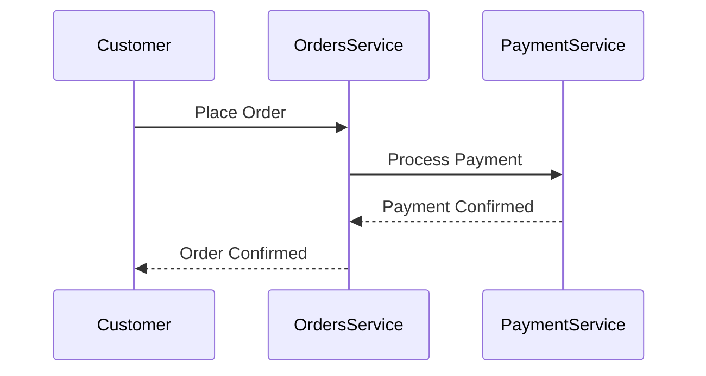

# EventCatalog Visualizations — Complete Reference

## Table of Contents

1. [Node Graph](#node-graph)
2. [Domain Integration Map](#domain-integration-map)
3. [Entity Map](#entity-map)
4. [Flow Diagrams](#flow-diagrams)
5. [Mermaid Support](#mermaid)
6. [Embedded Diagram Tools](#embedded-diagrams)
7. [Built-in MDX Components](#built-in-components)
8. [Custom Components](#custom-components)

---

## 1. Node Graph <a name="node-graph"></a>

The NodeGraph is EventCatalog's core visualization. It auto-generates interactive architecture diagrams based on resource relationships (sends/receives/channels).

### Basic Usage

Add to any resource's MDX body:

```mdx
<NodeGraph />
```

This renders a graph for the current resource showing its producers, consumers, channels, and data stores.

### Embed in Custom Pages

Specify the resource to visualize:

```jsx
<NodeGraph id="Orders" version="0.0.3" type="domain" />
<NodeGraph id="OrderService" type="service" />
<NodeGraph id="OrderPlaced" type="event" />
```

### Props

| Prop | Type | Description |
|------|------|-------------|
| `id` | string | Resource ID (not needed when inside a resource page) |
| `version` | string | Specific version (default: latest) |
| `type` | string | Resource type: `domain`, `service`, `event`, `command`, `query` |

### Features

- Interactive zoom, pan, and search
- Click nodes to navigate to resource pages
- Shows message flow direction with arrows
- Displays channels between producers and consumers
- Color-coded by resource type

### Customizing Node Appearance

In the resource's frontmatter:

```yaml
styles:
  icon: "BellIcon"              # Any Heroicons name
  node:
    color: purple                # Node background color
    label: "Custom Label"        # Override display label
```

### Controlling Visibility

Hide a resource from the visualizer:

```yaml
visualiser: false
```

---

## 2. Domain Integration Map <a name="domain-integration-map"></a>

High-level view showing all domains, their services, and cross-domain message flows. Think of it as a "birds-eye view" of your architecture.

### Access

- Automatically available in domain navigation (when at least one domain exists)
- Shows inter-domain message flows

### Features

- All domains displayed as groups
- Services within each domain
- Message flows crossing domain boundaries
- Interactive navigation

---

## 3. Entity Map <a name="entity-map"></a>

Visualizes entity relationships within a domain, showing references between entities (hasOne, hasMany).

### Usage

Automatically available as a page in domain navigation when entities are defined.

Or embed in any MDX content:

```jsx
<EntityMap id="Orders" />
```

The map reads entity `properties` with `references` and `relationType` to draw relationship lines.

---

## 4. Flow Diagrams <a name="flow-diagrams"></a>

Visual step-by-step representation of business workflows defined in flow resources.

### Embedding in Pages

```jsx
<Flow id="CancelSubscription" version="latest" includeKey={false} />
```

### Props

| Prop | Type | Description |
|------|------|-------------|
| `id` | string | Flow resource ID |
| `version` | string | Version (default: latest) |
| `includeKey` | boolean | Show the legend/key (default: true) |

### How Flows Are Rendered

Each step in the flow's `steps` array becomes a node:

- **Actor nodes**: Person/role icons
- **Service nodes**: Linked to service pages
- **Message nodes**: Linked to event/command/query pages
- **External system nodes**: Styled differently, optional links
- **Custom nodes**: User-defined appearance
- **Flow nodes**: Links to nested sub-flows

Connections use `next_step` (single) or `next_steps` (branching) to draw arrows between nodes.

---

## 5. Mermaid Support <a name="mermaid"></a>

EventCatalog supports Mermaid v11.x diagrams natively in MDX content.

### Inline Mermaid

````mdx

````

### From File

```jsx
<MermaidFileLoader file="diagram.mmd" />
```

Place the `.mmd` file alongside the resource's `index.mdx`.

### Supported Diagram Types

- Flowcharts / Graph diagrams
- Sequence diagrams
- Class diagrams
- ER diagrams
- State diagrams
- Gantt charts
- Journey maps
- Architecture diagrams

### Configuration

In `eventcatalog.config.js`:

```javascript
mermaid: {
  iconPacks: ['logos'],           // Icon packs from icones.js.org
  maxTextSize: 100000,            // Maximum diagram text size
}
```

### Features

- ELK layout algorithm support for complex diagrams
- Interactive controls: zoom, pan, fullscreen, copy
- Icon packs from icones.js.org

### Structurizr Integration

Export Structurizr C4 diagrams to Mermaid format, then embed:

```jsx
<MermaidFileLoader file="c4-diagram.mmd" />
```

---

## 6. Embedded Diagram Tools <a name="embedded-diagrams"></a>

Embed external diagram tools directly into EventCatalog pages.

### Miro

```jsx
<Miro boardId="uXjVNfJNOvs=" edit={false} />
```

### IcePanel

```jsx
<IcePanel url="https://app.icepanel.io/landscapes/..." />
```

### Lucidchart

```jsx
<Lucid diagramId="your-diagram-id" />
```

### DrawIO

```jsx
<DrawIO url="https://app.diagrams.net/..." />
```

### FigJam

```jsx
<FigJam url="https://www.figma.com/board/..." />
```

---

## 7. Built-in MDX Components <a name="built-in-components"></a>

These components are available in any resource's MDX body without importing.

### Schema Rendering

```jsx
<!-- Render schema as a code block -->
<Schema file="schema.json" />
<Schema file="schema.avro" />
<Schema file="schema.proto" />

<!-- Interactive viewer (JSON Schema and Avro only) -->
<SchemaViewer file="schema.json" title="JSON Schema" maxHeight="500" search="true" expand="true" />

<!-- Fetch and render remote schema (SSR mode only) -->
<RemoteSchema
  url="https://api.example.com/schemas/user.json"
  title="User Schema"
  maxHeight="600"
  headers={{ "Authorization": "Bearer ${API_TOKEN}" }}
  jsonPath="$.components.schemas.UserEvent"
  raw={false}
/>
```

### Layout Components

```jsx
<!-- Accordion -->
<Accordion title="Click to expand">
  Hidden content here...
</Accordion>

<AccordionGroup>
  <Accordion title="Section 1">Content 1</Accordion>
  <Accordion title="Section 2">Content 2</Accordion>
</AccordionGroup>

<!-- Steps -->
<Steps>
  <Step title="First Step">Do this first.</Step>
  <Step title="Second Step">Then do this.</Step>
</Steps>

<!-- Tabs -->
<Tabs>
  <Tab title="JavaScript">JS code here</Tab>
  <Tab title="Python">Python code here</Tab>
</Tabs>

<!-- Tiles -->
<Tiles columns={3}>
  <Tile icon="BookOpenIcon" href="/docs" title="Documentation" description="Get started" />
  <Tile icon="CodeIcon" href="/api" title="API" description="API reference" />
</Tiles>
```

### Admonitions (Callout Boxes)

```jsx
<Admonition type="info" title="Note">Informational content</Admonition>
<Admonition type="warning" title="Warning">Warning content</Admonition>
<Admonition type="tip" title="Tip">Helpful tip</Admonition>
<Admonition type="danger" title="Danger">Critical warning</Admonition>
```

### Resource Links

```jsx
<ResourceLink id="OrderService" type="service" />
<ResourceLink id="OrderPlaced" type="event" />
```

### Data Tables

```jsx
<!-- Message table for domains/services -->
<MessageTable />

<!-- Resource group table -->
<ResourceGroupTable id="order-resources" />

<!-- Channel info display -->
<ChannelInformation />

<!-- Entity properties table -->
<EntityPropertiesTable />

<!-- Attachments display -->
<Attachments />
```

---

## 8. Custom Components <a name="custom-components"></a>

### Astro Components

Create in `/components/` directory:

```astro
---
// /components/my-component.astro
import config from "@config"
const { subtitle } = Astro.props;
---
<main>
    <span>{config.organizationName}</span>
    <span>{subtitle}</span>
</main>
```

Use in any resource:

```mdx
---
id: OrderAccepted
name: Order Accepted
version: 1.0.0
---
import MyComponent from '@catalog/components/my-component.astro'

<MyComponent subtitle="Custom content" />
```

### Reusable Snippets

Store in `/snippets/` directory:

```mdx
<!-- /snippets/my-snippet.mdx -->
Hello {props.name}! This is reusable content.
```

Usage:

```mdx
import MySnippet from '@eventcatalog/snippets/my-snippet.mdx';

<MySnippet name="World" />
```

### Accessing Frontmatter in MDX

```mdx
# {frontmatter.name}

Version: {frontmatter.version}

export const myVar = "Hello";
# {myVar}
```

### Client-Side Scripts

```astro
<button class="alert">Click me!</button>
<script>
  document.querySelectorAll('button.alert').forEach((button) => {
    button.addEventListener('click', () => alert('Clicked!'));
  });
</script>
```
